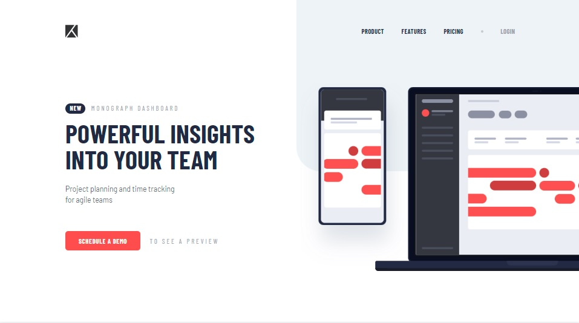
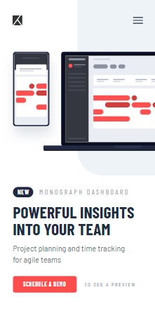
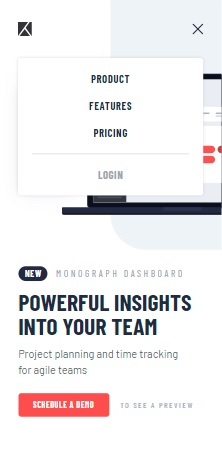

# Frontend Mentor - Project tracking intro component solution

This is a solution to the [Project tracking intro component challenge on Frontend Mentor](https://www.frontendmentor.io/challenges/project-tracking-intro-component-5d289097500fcb331a67d80e). Frontend Mentor challenges help you improve your coding skills by building realistic projects. 

## Table of contents

- [Overview](#overview)
  - [The challenge](#the-challenge)
  - [Screenshot](#screenshot)
  - [Links](#links)
- [My process](#my-process)
  - [Built with](#built-with)
  - [What I learned](#what-i-learned)
  - [Continued development](#continued-development)
  - [Useful resources](#useful-resources)
- [Author](#author)
- [Acknowledgments](#acknowledgments)

## Overview

### The challenge

Users should be able to:

- View the optimal layout for the site depending on their device's screen size
- See hover states for all interactive elements on the page
- Create the background shape using code

### Screenshot

| Desktop layout |
|:--:|

| Mobile layout |
|:--:|
 

### Links

- Solution URL: https://github.com/PavlinaPs/react-project-tracking-intro-component
- Live Site URL: https://pavlinaps.github.io/react-project-tracking-intro-component/

## My process

### Built with

- Semantic HTML5 markup
- CSS custom properties
- Flexbox
- CSS Grid
- Mobile-first workflow
- [React](https://reactjs.org/) - JS library

### What I learned

This is my first layout using React.js! I need to get used to the React environment, starting with small projects. It went well, I think. I ran into some issues, but solved them quite quickly.

### Continued development

I will continue using React.js and improve with every layout.

### Useful resources

- [Favicon in React will not Update](https://stackoverflow.com/questions/51994375/favicon-in-react-will-not-update)
- [Hamburger Menu ReactJS](https://youtu.be/Et5tDPoU03c)
- [Host React.js App for FREE in 5 mins with GitHub Pages](https://youtu.be/2hM5viLMJpA)
- [Host React.js App for FREE in 5 mins with GitHub Pages](https://youtu.be/2hM5viLMJpA)

## Author

- GitHub - [PavlinaPs](https://github.com/PavlinaPs)
- Frontend Mentor - [@PavlinaPs](https://www.frontendmentor.io/profile/PavlinaPs)

## Acknowledgments

It is great that I can solve Frontend Mentor's challenges. They are all very useful for me. Every single one. Thank you!
